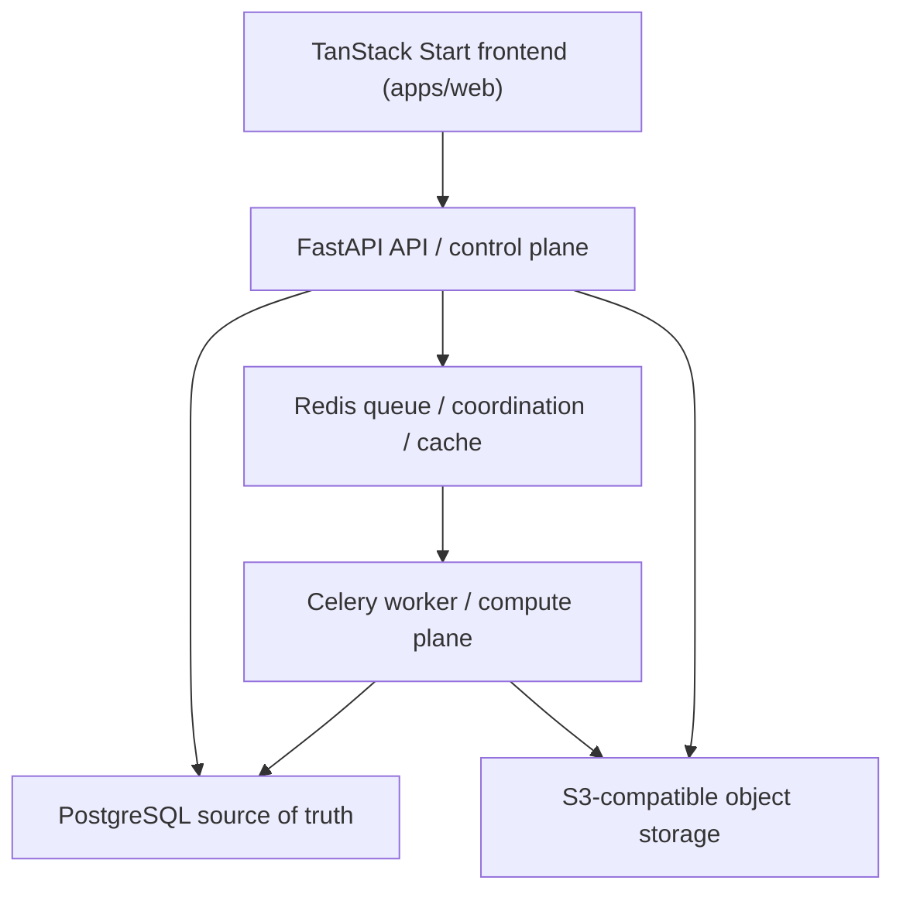

# System Architecture

The API is stateless and owns request authentication, authorization, and control-plane workflows. The worker is the compute plane and receives stable IDs only. PostgreSQL persists business state. Redis is not a source of truth. Object storage contains binary media.

Scale path starts with API replicas and default workers, then queue specialization for media, AI, analytics, exports, integrations, and notifications.
